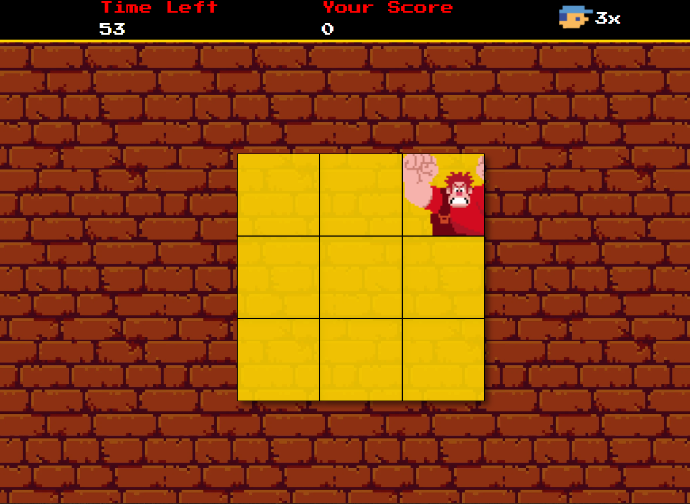
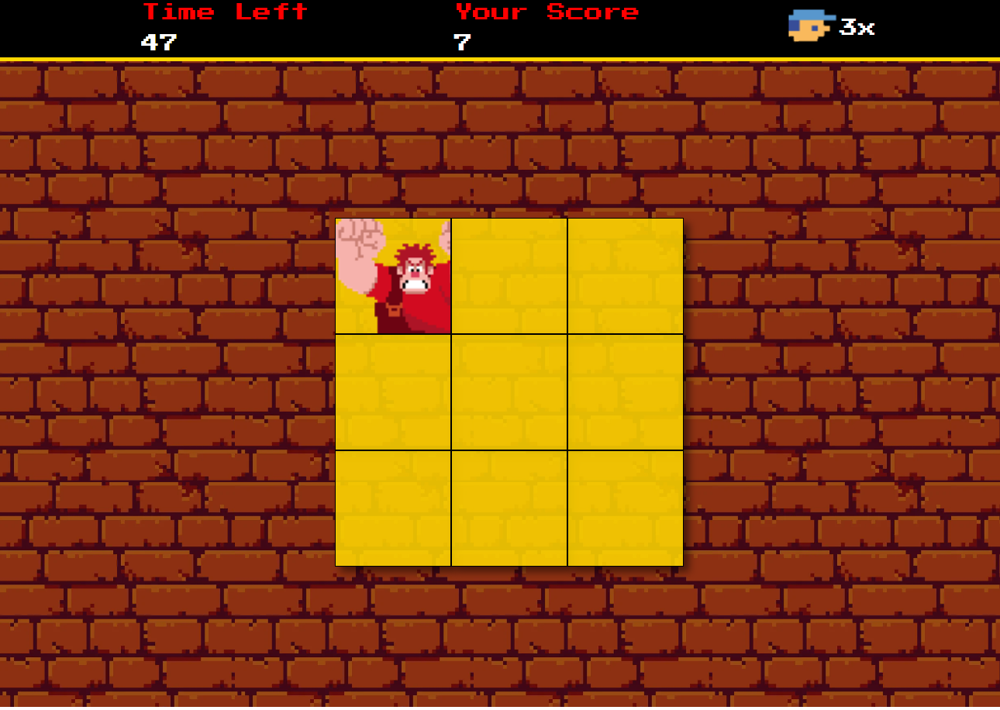

<h1 align="center" style="font-weight: bold;">Detona Ralph em JavaScript 💻</h1>

 <a href="#description">Description</a> •
 <a href="#technologies">Technologies</a> • 
 <a href="#Toplay">To Play</a> 

<h2 id="layout">🎨 Layout</h2>

    
    

<h2 id="description">📝description</h2>
 
Hello, how are you? I present the Wreck-It Ralph Game! This repository offers a cool game inspired by the children's comedy Wreck-It Ralph that demonstrates advanced JavaScript game development techniques.
 

  
 <h2>What the app does</h2>
 
Scoring System: Track your score as you progress through the game and challenge your friends to beat it, click on the square that Ralph is in.

 <h2 id="technologies">💻 Technologies</h2>

HTML5 and CSS3 were used to create the game's structure and appearance.

JavaScript was used to create the game logic.

<h2 id="Toplay">💻 To play</h2>
<ol>
    <li>Just clone the repository to your machine.</li>
    <li>Run the file named index.html in browser.</li>
    <li>Use the left mouse click on Ralf to hit him.</li>
    <li>Now you have a game to distract yourself.</li>
</ul>